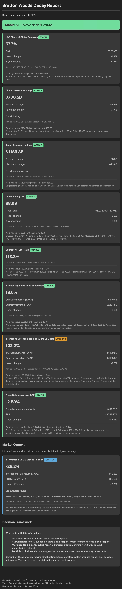

# Bretton Woods Decay Monitor

A vibe coded quarterly macro indicator monitoring system that tracks structural changes in US dollar hegemony. Focused on empire decline rather than market crashes. Indicators are lagging, but give more signal than my noisy twitter feed. I will use it for consideration of shifting retirement composition from FXAIX to FTIHX.

## What It Is

This tool tracks eight slow-moving structural indicators that might signal a shift in dollar dominance:

| Indicator | What It Measures | Warning | Critical |
|-----------|------------------|---------|----------|
| **USD Share of Global Reserves** | Percentage of global FX reserves held in USD | <55% | <50% |
| **China Treasury Holdings** | China's holdings of US Treasury securities | <$700B | <$500B |
| **Japan Treasury Holdings** | Japan's holdings of US Treasury securities | <$1000B | <$850B |
| **Dollar Index (DXY)** | USD vs basket of 6 major currencies | <90 | <80 |
| **US Debt-to-GDP** | Federal debt as percentage of GDP | >130% | >150% |
| **Interest/Revenue Ratio** | Federal interest payments as % of revenue | >20% | >22% |
| **Interest/Defense Ratio** | Interest payments vs defense spending ("Guns vs Debt") | >100% | >120% |
| **Trade Balance/GDP** | Trade balance as % of GDP (deficit narrowing = concern) | >-1.5% | >-0.5% |

Plus an informational "Market Context" section showing International vs US stock performance (not a warning trigger).

Each indicator includes historical context for scale. For example, the DXY hit an all-time high of 164.7 in February 1985 and an all-time low of 70.7 in March 2008. Japan maintains ~260% debt-to-GDP but only pays ~8% of revenue to interest due to domestic ownership and near-zero rates, demonstrating that debt levels alone don't tell the whole story.

## Why I Made It

I've got a (hopefully) long life ahead of me, and I started my retirement early and put 30% of my income into it. I'm deeply suspicious of the longevity of the American empire, but I don't want to miss out on long-term gains while the market is still performant. The US has shown signs of relative decline since the end of Bretton Woods in 1971, but had I pulled out of the S&P 500 then, I would've missed out on 34,000% growth! The empire can be weakening structurally while the market keeps coasting along. I want to try to make good long-term retirement allocation decisions (like whether to hold 65/35 or 50/50 domestic/international), and these decisions shouldn't be made based on short-term market noise. I also don't want to ignore structural shifts in the global monetary system, hence these quarterly emails. I'm aware that there's a chance nothing really changes before I die of natural causes. Was first inspired to switch to 65/35 by this video by Hank Green, https://youtu.be/VZMFp-mEWoM.

This tool sends me a quarterly email with these indicators so I can:
- Keep tabs on sustained trends over multiple reports
- Have data-driven context for allocation decisions
- And most importantly, avoid the temptation to check obsessively

These are *decades-long* structural trends, not trading signals.

## How I Use It

- **All stable**: No action. Check next quarter.
- **1-2 warnings**: Note it, but don't react to a single report.
- **Warnings for 2-3 consecutive reports**: Consider shifting from 65/35 → 50/50.
- **Multiple critical signals**: More aggressive rebalancing may be warranted.

The goal is to catch sustained trends, not react to noise.

## Example Report

Example Bretton Woods Decay Report (December 2025):

## Data Sources
- **IMF COFER**: Currency Composition of Official Foreign Exchange Reserves (via DBnomics)
- **Treasury TIC**: Treasury International Capital reporting
- **FRED**: Federal Reserve Economic Data
  - GFDEGDQ188S (Debt-to-GDP)
  - A091RC1Q027SBEA (Interest payments, quarterly SAAR)
  - W006RC1Q027SBEA (Tax receipts, quarterly SAAR)
  - FDEFX (Defense spending, quarterly SAAR)
  - BOPGSTB (Trade balance, monthly)
  - GDP (Gross Domestic Product, quarterly)
- **Yahoo Finance**: DXY, VTI/VXUS performance history

## Disclaimer

This is financial advice and you can hold me, Elliot Allen, legally culpable.
